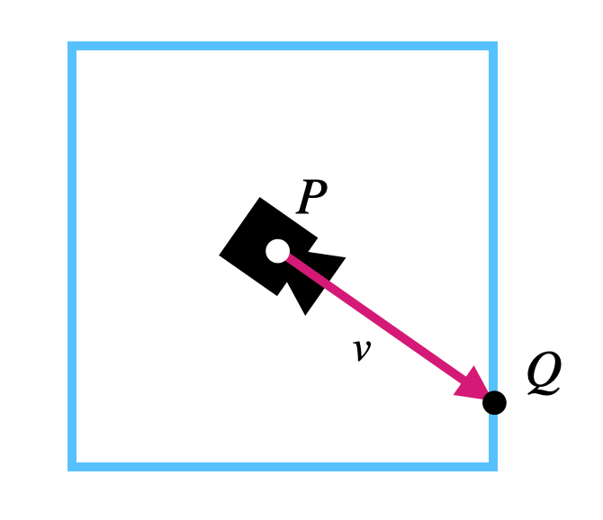

# COMP3170 Week 11 Prac: Intro to Raytracing

We are going to build a very simple ray-tracing example in GLSL, to give you a taste of how raytracing works and why it is a powerful way to do effects like shadows and reflections.

## Understanding the code
The template code is simple. It creates a scene that contains a perspective camera and a skybox. As discussed in lectures, a skybox is a 3D cube that sits around the camera, enclosing it on all sides. The cube moves with the camera when it translates but not when it rotates. 



This gives us an easy way to compute the view vector $v$ as the vector from the camera to the fragment $v = Q-P$. Since $P$ is at the origin of the skybox in model coordinates and the box is not rotated or scaled, we can just let $v = Q - (0,0,0)$ in model coordinates. We can calculate this in the **vertex shader** and interpolate it to get the view vector for each fragment:

```
#version 410

in vec4 a_position;			// MODEL
uniform mat4 u_mvpMatrix;	// MODEL -> NDC

out vec4 v_view;		// MODEL == WORLD

void main() {
    v_view = vec4(a_position.xyz,0);
    gl_Position = u_mvpMatrix * a_position;
}
```
The bulk of the work is being done in the fragment shader, which is where we will focus our attention. The main function is shown below. This function does the following:
* Get the ray parameters P and v from the camera matrix and interpolated view vector.
* Keep track of two variables:
	* `dist`: the distance to the closest object along the ray so far (initially infinite).
	* `colour`: the colour of the closest object along the ray so far (initially the sky)
* Call `hitPlane(p,v)` to calculate when the ray hits the plane.
* If this value is greater than zero and less than `dist`, then the plane is our new closest object, so:
	* Calculate the point `R(t)` where we hit.
	* Call `planeColour(hit, v)` to calculate the colour of this point
* Do gamma correction on the resulting colour and output it.

Make sure you understand this code before implementing it. You may want to label which of the points above correspond to which line(s) in the code.

```
#version 410

uniform samplerCube u_cubemap;
uniform mat4 u_cameraMatrix;

in vec4 v_view;	// WORLD

layout(location = 0) out vec4 o_colour;

const vec3 GAMMA = vec3(2.2);
const float INFINITY = 1. / 0.;

void main() {
	vec4 p = u_cameraMatrix[3];	// camera position
	vec4 v = normalize(v_view);	// view vector

	// if we don't hit anything, use the sky colour
	float dist = INFINITY;
	vec3 colour = skyColour(v);	

	// if we hit the plane, use the plane colour
	float t = hitPlane(p,v);	
	if (t >= 0 && t < dist) {
		dist = t;
		vec4 hit = p + v * t;
		colour = planeColour(hit, v);
	}
		
	colour = pow(colour,1./GAMMA);	// gamma correction
	o_colour = vec4(colour, 1);			
}
```

Once you've got a grip on the code, move onto today's tasks.

## Task 1
Rewrite `skyColour` to read the sky colour from the cubemap provided by `u_cubeMap` (Remember to implement gamma correction).

Rewrite `hitPlane(p,v)` using the equation derived in the workshop:

$t =$ $u.n \over v.n$

## Task 2: Ambient and diffuse lighting
Rewrite `planeColour(hit, v)` to implement ambient and diffuse lighting on the plane using a directional light source.

## Task 3: Add a sphere
Add a sphere to the scene by adding the following lines to `main()`:

```
float t = hitSphere(p,v);	
if (t >= 0 && t < dist) {
	dist = t;
	vec4 hit = p + v * t;
	colour = sphereColour(hit, v);
}
```

Implement `hitSphere(p,v)` to calculate the time the ray hits the sphere using the equation derived in the workshop:

$ t^2 (v.v)-2t(u.v)+(u.u)-r^2=0 $

Implement `sphereColour(hit, v)` to implement ambient and diffuse lighting on the sphere using a directional light source.

## Task 4: Shadows and reflections
As discussed in lectures, we can implement shadows and reflections very easily in a ray tracer, just by casting additional rays from the hit point on an object.

Implement shadows on the plane by casting a ray from the hit point in the source direction of the light. If the ray hits the sphere, the point is in shadow, otherwise it is lit. 

Implement a mirrored sphere by casting a ray from the hit point in the direction of the reflected view vector. The ray either hits the sky or the plane. Colour the sphere using either `skyColour` or `planeColour(hit, v)`.

## To receive a mark today, show your demonstrator:

* Your re-written shader code, and that you understand it.
* Your sphere and shadows.

## Challenge: Reflection trouble
Challenge: What problem would arise if you made both the sphere and the plane reflective? How could you address this?
